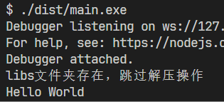
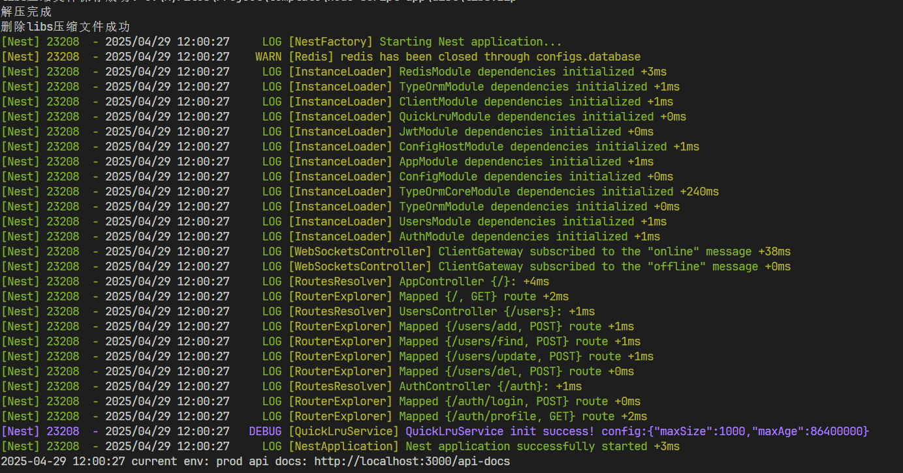

# 🔥 NodeTriPack - 将 Node.js 项目打包为独立可执行文件！支持 Windows EXE/macOS App/Linux 二进制，零配置跨平台适配神器

✨ **支持平台**：Windows/macOS/Linux（x64/ARM）  
⚡ **核心特性**：零配置打包、自动处理依赖、支持原生模块  
📈 **体积优化**：内置压缩脚本，程序平均体积减少 40%

## 描述

-   可当 nodejs 脚本开发模板，也可以打包已有的项目。
-   打包结果在 dist 目录下

可以使用本地的模板在 src 下二次开发 nodejs 项目，打包成可执行文件，支持跨平台，支持原生模块，支持零配置打包，支持体积优化，支持自动处理依赖。也可以打包外部 nodejs 项目，前提该项目是一个单 js 文件。

## 示例

### 1. 打包本项目

-   npm run build:this-prod-win
-   ./dist/main.exe
    

### 2. 打包外部项目

-   外部项目放在./tmp 目录下
-   main.js && package.json 项目结构：
    ```plaintext
    node-tri-pack/
    ├── ...
    ├── tmp/
    │ ├── main.js
    │ └── package.json
    └── ...
    ```
-   npm run build:external-win
-   ./dist/main.exe

*   执行结果(以 nestJS 应用为例子)
    

## 🔧 使用

1. **⬇️ 拉取代码**：

    `git clone *`

2. **📦 安装依赖**：

    `npm install`

3. **🐞 调试**：

    `npm run start`

    `npm run start:prod` (production)

4. **👀 预览**：

`npm run webpack:prod`

5. **🚀 打包 src**:

    `npm run build:this-prod-win` (win32)

    `npm run build:this-prod-mac` (macOS)

    `npm run build:this-prod-linux` (Linux)

6. **🚀 打包外部项目** :(见路径配置：

    `npm run build:external-win` (win32)

## 为什么做

-   pkg 支持到 node18，但是 node 已经更新到 22+

-   nexe 支持到 node14

-   electorn 太大了，不适合执行小脚本

-   node20+ 自带跨端打包 sea

## 思路|解决方式

### 思路：

node sea 可以将一个 js 打包成可执行文件并且跨平台，但是我们开发不可能只用一个文件，经过测试，可以引用外部的 js 文件，但是开发很吃力，所以我选择用 webpack 将项目打包成一个文件，那么还要考虑 node_models 的依赖，经过测试打包好的可执行文件无法找到 node_models 的下的依赖，这样一切都变得没意义了，不能引用外部文件 node 也失去了灵魂，所以又手写了一个脚本来帮助 node 找到依赖，同时因为 models 太大，我们把它压缩在程序中，由程序运行的时候解压，这样一个完整的思路就出现了。

### 解决问题路径：

1. 搭建一个 ts-node + webpack 的项目

2. 配置 webpack 使用 ts-loader 将项目打包成一个单文件 js

3. 移动 package.json 脚本，将生产环境依赖安装好

4. 阅读[sea 单个可执行应用程序 | Node.js v23 文档](https://nodejs.cn/api/single-executable-applications.html) 这个文档

5. 压缩脚本: 将生产环境 node_models 打包成一个.zip

6. 配置 sea：将.zip 注入到 exe 中

7. 前缀脚本: 用于修改 node 引入依赖的错误的方法

8. 前缀脚本: 用于解压.zip （这里 exe 中没有外部包很难做到原生 node 解压，我们通过判断环境用操作系统自带命令行解压注入好的.zip

9. 将 node 解析路径更改为我们解析好的文件夹

10. 删除.zip

本工具持续更新中，欢迎 star，欢迎提 issues
